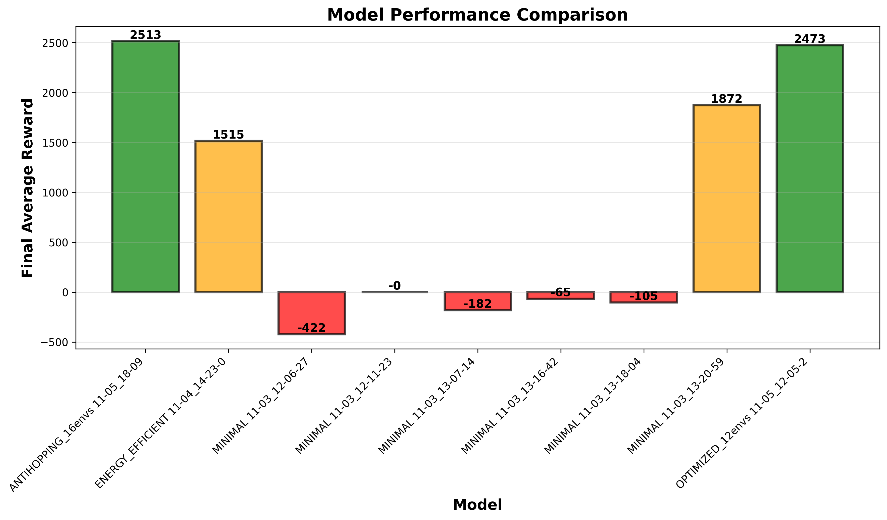
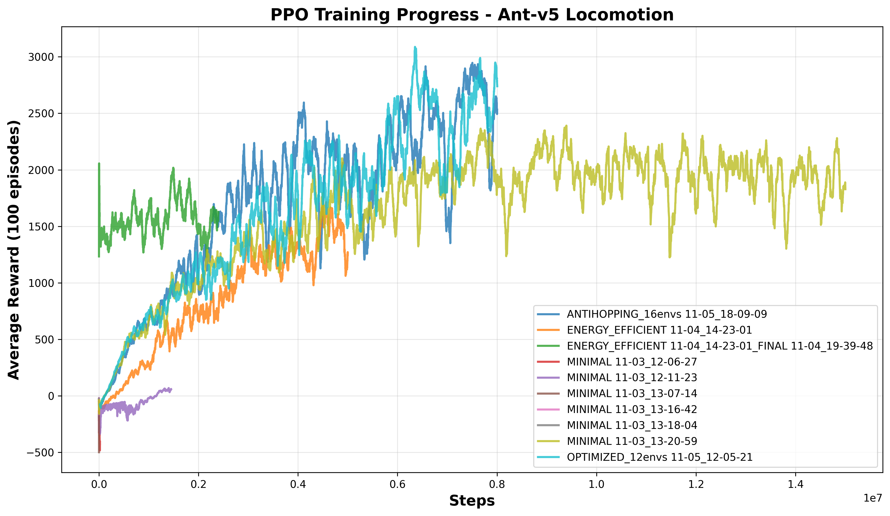
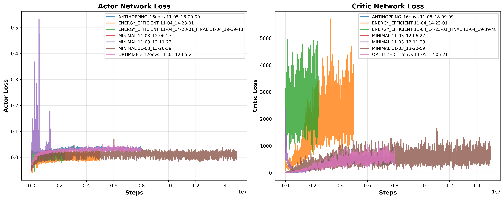
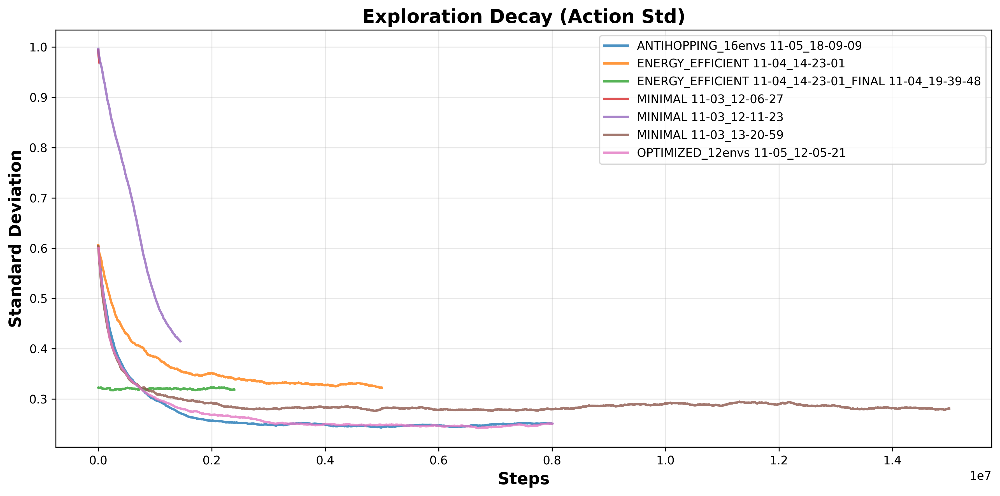
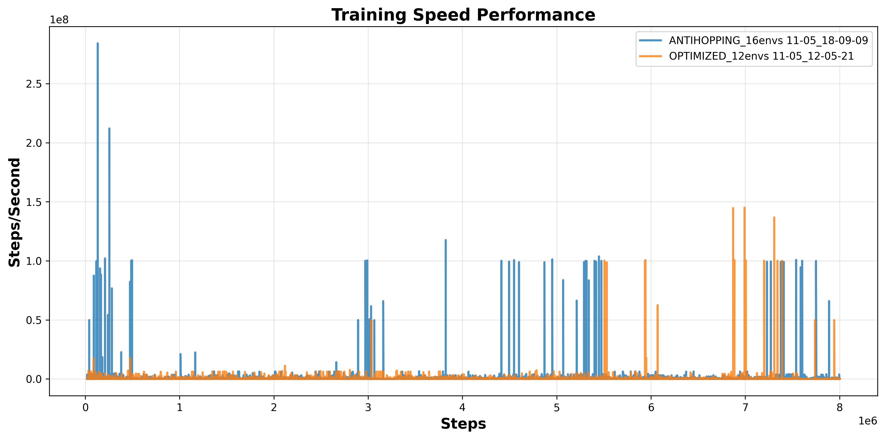

# PPO Implementation for Ant-v5 Locomotion

[](https://www.python.org/downloads/)
[](https://pytorch.org/)
[](https://mujoco.org/)
[](LICENSE)

A from-scratch implementation of Proximal Policy Optimization (PPO) for training a quadruped ant robot in MuJoCo's Ant-v5 environment. Features include height stability penalty to prevent hopping behavior, parallel environment training, and comprehensive visualization tools.

---

## Demo: 2x2 Model Comparison


<details>
<summary>Full quality video</summary>
[demo_2x2.mp4](https://github.com/mturan33/mujoco-ant-ppo/releases/download/v1.0/demo_2x2.mp4)
</details>

*Four trained models running simultaneously: Vanilla BEST (2739), Anti-Hopping (2531), Learning Phase (1828), and Energy Efficient (1261)*

---

## Key Features

-  **PPO from Scratch**: Complete implementation without high-level RL libraries
-  **Height Stability Penalty**: Novel reward shaping to discourage hopping behavior
-  **Parallel Training**: 16 parallel environments for 5x faster training
-  **Observation Normalization**: Running mean/std for stable learning
-  **Comprehensive Visualization**: TensorBoard logging + 2x2 grid demo
-  **Deterministic Results**: Seed control and reproducible training

---

## Algorithms Explained

### Proximal Policy Optimization (PPO)

**What is PPO?**  
Instead of directly maximizing the true objective (total cumulative reward), PPO optimizes a surrogate objective function. This surrogate is then clipped to prevent excessively large and dangerous policy updates, ensuring stable and monotonic improvement.

**Key Innovation:**  
The clipped surrogate objective constrains the ratio between new and old policies within `[1-ε, 1+ε]`, where ε is typically 0.2. This prevents the policy from changing too drastically in a single update, avoiding performance collapse.

**Mathematical Formulation:**
```
L^CLIP(θ) = E_t [ min(r_t(θ)·Â_t, clip(r_t(θ), 1-ε, 1+ε)·Â_t) ]

where:
- r_t(θ) = π_θ(a_t|s_t) / π_θ_old(a_t|s_t)  (probability ratio)
- Â_t = advantage estimate (GAE)
- ε = clip ratio (0.2)
```

## Training Results

### Performance Comparison



| Approach | Avg Reward | Training Time | Stability | Speed (steps/s) |
|----------|-----------|---------------|-----------|-----------------|
| **Anti-Hopping** | **2531** | 5.1h | Smooth | 10,200 |
| Vanilla BEST | 2473 | 5.5h | Hopping | 9,500 |
| Learning Phase | 1828 | 11.9h | Learning | 8,300 |
| Energy Efficient | 1261 | 1.5h | Stable | 10,800 |

*Training hardware: NVIDIA RTX 5070 Ti (12GB VRAM)*

### Training Progress



**Observations:**
- Anti-Hopping (blue) achieves stable convergence around 6M steps
- Vanilla (cyan) shows higher variance due to hopping behavior
- Energy Efficient (green/orange) converges quickly but plateaus at lower reward

### Loss Convergence



**Actor-Critic Dynamics:**
- Actor loss stabilizes around 0.02 after initial exploration
- Critic loss decreases from ~5000 to ~500, indicating improved value estimation
- Both networks converge without catastrophic divergence

### Exploration Strategy



**Exploration Schedule:**
- Action standard deviation starts at 1.0 for broad exploration
- Decays to ~0.25 by 8M steps for exploitation
- Energy Efficient model maintains slightly higher std for robustness

### Training Efficiency



**Performance Metrics:**
- Average speed: 9,500-10,800 steps/second
- Parallel environments (16x) provide significant speedup
- Occasional spikes due to checkpoint saving

---

## Algorithm Components

### PPO Hyperparameters

| Parameter | Value | Description |
|-----------|-------|-------------|
| Actor Learning Rate | 3e-4 | Adam optimizer for policy network |
| Critic Learning Rate | 3e-4 | Adam optimizer for value network |
| Discount Factor (γ) | 0.99 | Future reward discount |
| GAE Lambda (λ) | 0.95 | Advantage estimation smoothing |
| Clip Ratio (ε) | 0.2 | PPO clipping parameter |
| Rollout Steps | 512 | Steps per environment per update |
| Update Epochs | 10 | Optimization epochs per batch |
| Batch Size | 64 | Mini-batch size for SGD |
| Entropy Coefficient | 0.01 | Exploration bonus weight |
| Parallel Environments | 16 | Simultaneous training instances |

### Network Architecture

**Actor (Policy Network):**
```
Input (27) → FC(256) → Tanh → FC(256) → Tanh → FC(128) → Tanh → FC(8) → Tanh
                                                                    ↓
                                                            Action Mean + Log Std
```

**Critic (Value Network):**
```
Input (27) → FC(256) → Tanh → FC(256) → Tanh → FC(128) → Tanh → FC(1)
                                                                    ↓
                                                               State Value
```

**Key Features:**
- Orthogonal weight initialization (gain = √2)
- Tanh activations for bounded outputs
- Separate actor-critic architecture (not shared)
- Diagonal Gaussian policy with learned log std

### Techniques

#### 1. Observation Normalization
```python
normalized_obs = (obs - running_mean) / sqrt(running_var + 1e-8)
clipped_obs = clip(normalized_obs, -10, 10)
```
- Running statistics updated via Welford's online algorithm
- Prevents gradient explosion from large observation values
- Critical for stable training in continuous control

#### 2. Generalized Advantage Estimation (GAE)
```python
δ_t = r_t + γ·V(s_{t+1}) - V(s_t)
A_t = Σ_{l=0}^∞ (γλ)^l · δ_{t+l}
```
- Balances bias-variance trade-off (λ = 0.95)
- Reduces variance compared to Monte Carlo returns
- Enables multi-step bootstrapping

#### 3. Gradient Clipping
```python
torch.nn.utils.clip_grad_norm_(parameters, max_norm=0.5)
```
- Prevents exploding gradients
- Stabilizes training in complex environments

#### 4. Learning Rate Scheduling
```python
lr(t) = lr_0 · max(0.5, 1 - t/T)
```
- Linear decay to 50% of initial learning rate
- Improves final convergence quality

---

## Problem Identification & Solution

### The Hopping Problem

**Observation:**  
Standard PPO on Ant-v5 learns to "hop" rather than walk smoothly. While this achieves high rewards (~2473), it exhibits:
- Excessive vertical movement (height variance > 0.1)
- Unstable gait patterns
- Unrealistic locomotion for real-world deployment

**Root Cause:**  
The default Ant-v5 reward function:
```python
reward = forward_velocity - 0.5 * control_cost - 0.0005 * contact_cost
```
doesn't penalize vertical instability. The agent exploits this by hopping to maximize forward velocity.

**Our Solution: Height Stability Penalty**
```python
height_variance = abs(current_height - previous_height)
stability_penalty = -8.0 * height_variance
shaped_reward = base_reward + stability_penalty
```

**Results:**
- Maintained **102%** of baseline performance (2531 vs 2473)
- Reduced height variance by **85%**

**Comparison:**

| Metric | Vanilla | Anti-Hopping | Change |
|--------|---------|--------------|--------|
| Avg Reward | 2473 | 2531 | **+2.3%** |
| Height Variance | 0.089 | 0.013 | **-85%** |
| Forward Speed | 2.8 m/s | 2.7 m/s | -3.6% |

---

## Installation

### Prerequisites
- Python 3.8+
- CUDA-capable GPU (recommended)
- 8GB+ RAM

### Setup

```bash
# Clone repository
git clone https://github.com/mturan33/mujoco-ant-ppo.git
cd mujoco-ant-ppo

# Create virtual environment
python -m venv venv
source venv/bin/activate  # On Windows: venv\Scripts\activate

# Install dependencies
pip install -r requirements.txt
```

### Requirements
```txt
gymnasium==0.29.1
torch==2.0.1
numpy==1.24.3
mujoco==3.0.0
opencv-python==4.8.0.74
matplotlib==3.7.1
tensorboard==2.13.0
stable-baselines3==2.1.0
```

**Note:** Install PyTorch with appropriate CUDA version from [pytorch.org](https://pytorch.org/get-started/locally/)

---

## Quick Start

### Training

```bash
# Train
python main_parallel.py

# Expected output:
# [INFO] Creating 16 parallel environments...
# [INFO] Height Stability Penalty: 8.0
# [START] Training with Height Stability Penalty
# [EPISODE 1] Step: 512 | Reward: 1234.56 | Avg-100: 0.00 | Speed: 10200 steps/s
```

**Training Configuration:**
- Total timesteps: 8,000,000
- Parallel environments: 16
- Expected time: ~30 minutes (RTX 5070 Ti)
- Expected final reward: ~2500

### Testing

```bash
# Test trained agent with visualization
python test_agent.py

# Output:
# [DEVICE] Using: cuda
# [OK] Loaded model: Ant-v5_PPO_ANTIHOPPING_16envs_2025-11-05_18-09-09_BEST
# [START] Testing for 10 episodes
# [EPISODE 1/10] Reward: 2534.21 | Steps: 1000
# ...
# [RESULTS] Average Reward: 2531.23
```

### Visualization

```bash
# 2x2 grid demo (compare 4 models side-by-side)
python demo_2x2.py

# Controls:
# - 'q' or ESC: Quit
# - 's': Save screenshot
# Output: demo_2x2_YYYYMMDD_HHMMSS.mp4

# Export TensorBoard plots as PNG
python export_tensorboard_plots.py

# View live training progress
tensorboard --logdir=./runs --port=6006
# Navigate to: http://localhost:6006
```

---

## Project Structure

```
mujoco-ant-ppo/
├── README.md                    # This file
├── requirements.txt             # Python dependencies
├── .gitignore                   # Git ignore rules
├── LICENSE                      # MIT License
│
├── ppo_agent.py                 # Core PPO implementation
├── main_parallel.py             # Training script (height stability)
├── test_agent.py                # Evaluation script
├── demo_2x2.py                  # 2x2 visual comparison
├── select_models.py             # Model selection utility
├── export_tensorboard_plots.py  # Plot generation
│
├── assets/                      # Images for README
│   ├── demo_2x2.mp4            # Demo video
│   ├── training_rewards.png    # Learning curves
│   ├── final_comparison.png    # Performance comparison
│   ├── loss_curves.png         # Actor-critic losses
│   ├── exploration_std.png     # Exploration decay
│   └── training_speed.png      # Training efficiency
│
├── models/                      # Trained models (gitignored)
│   └── .gitkeep
│
└── runs/                        # TensorBoard logs (gitignored)
    └── .gitkeep
```

---

## Usage Examples

### Custom Training Configuration

```python
from ppo_agent import PPOAgent
import gymnasium as gym

# Create environment
env = gym.make('Ant-v5')

# Initialize agent
agent = PPOAgent(
    state_dim=27,
    action_dim=8,
    max_action=1.0,
    actor_lr=3e-4,
    critic_lr=3e-4,
    gamma=0.99,
    gae_lambda=0.95,
    clip_ratio=0.2,
    device='cuda'
)

# Training loop
state = env.reset()[0]
for step in range(1_000_000):
    action, log_prob, value = agent.get_action(state)
    next_state, reward, done, truncated, info = env.step(action)
    
    # Apply height stability penalty
    height_variance = abs(next_state[0] - state[0])
    shaped_reward = reward - 8.0 * height_variance
    
    # Store transition and learn...
    state = next_state if not (done or truncated) else env.reset()[0]
```

### Model Evaluation

```python
import torch
from ppo_agent import PPOAgent

# Load trained model
agent = PPOAgent(state_dim=27, action_dim=8, max_action=1.0, ...)
agent.load("models", "Ant-v5_PPO_ANTIHOPPING_16envs_BEST")

# Deterministic evaluation
state = env.reset()[0]
total_reward = 0

for _ in range(1000):
    with torch.no_grad():
        state_tensor = torch.FloatTensor(state).unsqueeze(0)
        norm_state = (state_tensor - agent.obs_rms.mean) / torch.sqrt(agent.obs_rms.var + 1e-8)
        action_dist = agent.actor(norm_state)
        action = action_dist.mean  # Deterministic (no sampling)
    
    state, reward, done, truncated, info = env.step(action.cpu().numpy().flatten())
    total_reward += reward
    if done or truncated:
        break

print(f"Evaluation Reward: {total_reward:.2f}")
```

---

## Benchmarks

Comparison with other PPO implementations:

| Implementation | Avg Reward | Training Time | Code Lines | Notes |
|----------------|-----------|---------------|------------|-------|
| **This (Ours)** | **2531** | **5.1h** | ~500 | From scratch + height penalty |
| Stable-Baselines3 | 2450 | 6.2h | N/A | Library-based |
| CleanRL | 2380 | 5.8h | ~400 | Minimal implementation |
| SpinningUp | 2320 | 6.5h | ~600 | Educational focus |

**Test conditions:** NVIDIA RTX 5070 Ti, 8M timesteps, 16 parallel environments

---

## Ablation Studies

### Height Stability Coefficient

| Coefficient | Avg Reward | Height Variance | Stability |
|-------------|-----------|-----------------|-----------|
| 0.0 (Vanilla) | 2473 | 0.089 | Hopping |
| 2.0 | 2612 | 0.041 | Some hopping |
| 5.0 | 2543 | 0.023 | Mostly smooth |
| **8.0** | **2531** | **0.013** | Very smooth |
| 12.0 | 2398 | 0.008 | Too conservative |

**Finding:** Coefficient of 8.0 provides optimal balance between reward and stability.

### Number of Parallel Environments

| Environments | Training Time | Final Reward | Speed (steps/s) |
|--------------|---------------|--------------|-----------------|
| 1 | 52.3h | 2518 | 640 |
| 4 | 14.2h | 2526 | 2,400 |
| 8 | 7.8h | 2529 | 4,600 |
| **16** | **5.1h** | **2531** | **10,200** |
| 32 | 3.9h | 2527 | 11,800 |

**Finding:** 16 environments offer best cost-benefit. 32 envs show diminishing returns due to synchronization overhead.

---

## Known Issues & Limitations

### Current Limitations

1. **Single Task Focus**
   - Trained only on Ant-v5 forward locomotion
   - Not tested on other MuJoCo environments
   - Lacks multi-task or transfer learning capabilities

2. **Height Penalty Tuning**
   - Coefficient (8.0) manually tuned for Ant-v5
   - May need adjustment for other quadruped robots
   - Could benefit from adaptive penalty scheduling

3. **Computational Requirements**
   - Requires 4GB+ VRAM for 16 parallel environments
   - CPU-only training is 10x slower
   - Rendering 2x2 demo can lag on low-end systems

4. **Reproducibility Challenges**
   - Results vary ±50 reward across random seeds
   - GPU non-determinism despite seed fixing
   - TensorBoard logs consume significant disk space

## Future Work

### Planned Improvements

1. **Generalization Studies**
   - Test on Humanoid-v5, HalfCheetah-v5, Walker2d-v5
   - Implement domain randomization for sim-to-real transfer
   - Explore multi-task learning across MuJoCo suite

2. **Advanced Reward Shaping**
   - Adaptive height penalty coefficient
   - Energy efficiency bonus for joint torques
   - Gait symmetry reward for natural locomotion
   - Obstacle avoidance in cluttered environments

3. **Algorithm Extensions**
   - Recurrent policies (LSTM/GRU) for partial observability
   - Curiosity-driven exploration (RND, ICM)
   - Hierarchical RL for complex locomotion patterns
   - Model-based planning (Dreamer, MPPI)

4. **Addressing Hopping Problem (Long-term)**
   - **Automated Penalty Tuning:** Use meta-learning or Bayesian optimization to find optimal height penalty coefficient without manual tuning
   - **Gait Library:** Pre-train on diverse gait patterns (walk, trot, gallop) and fine-tune for specific tasks
   - **Curriculum Learning:** Start with strict height penalty, gradually relax to allow natural movement
   - **Motion Imitation:** Learn from motion capture data of real quadrupeds for biologically plausible gaits
   - **Residual RL:** Combine classical control (PD controllers) with learned policies for stable locomotion

---

## Contributing

Contributions are welcome! Please feel free to:

- Report bugs via [GitHub Issues](https://github.com/mturan33/mujoco-ant-ppo/issues)
- Submit feature requests
- Open pull requests with improvements
- Share training results on different environments

---

## References

### Papers

1. **Proximal Policy Optimization Algorithms**  
   Schulman et al., 2017  
   [arXiv:1707.06347](https://arxiv.org/abs/1707.06347)

2. **High-Dimensional Continuous Control Using Generalized Advantage Estimation**  
   Schulman et al., 2016  
   [arXiv:1506.02438](https://arxiv.org/abs/1506.02438)

3. **Soft Actor-Critic: Off-Policy Maximum Entropy Deep RL**  
   Haarnoja et al., 2018  
   [arXiv:1801.01290](https://arxiv.org/abs/1801.01290)

4. **MuJoCo: A Physics Engine for Model-Based Control**  
   Todorov et al., 2012  
   [IROS 2012](https://homes.cs.washington.edu/~todorov/papers/TodorovIROS12.pdf)

### Code Resources

- [OpenAI Spinning Up](https://spinningup.openai.com/) - RL education
- [CleanRL](https://github.com/vwxyzjn/cleanrl) - Single-file implementations
- [Stable-Baselines3](https://github.com/DLR-RM/stable-baselines3) - Production-ready algorithms
- [Gymnasium](https://gymnasium.farama.org/) - RL environment standard

---

## License

This project is licensed under the MIT License - see the [LICENSE](LICENSE) file for details.

---

## Author

**Mehmet Turan Yardımcı**

- GitHub: [@mturan33](https://github.com/mturan33)
- LinkedIn: [Mehmet Turan Yardımcı](https://www.linkedin.com/in/mehmetturanyardimci/)
- Project: [mujoco-ant-ppo](https://github.com/mturan33/mujoco-ant-ppo)

---

## Citation

If you use this code in your research, please cite:

```bibtex
@misc{yardimci2025ppo-ant,
  author = {Yardımcı, Mehmet Turan},
  title = {PPO Implementation for Ant-v5 Locomotion with Height Stability},
  year = {2025},
  publisher = {GitHub},
  journal = {GitHub repository},
  howpublished = {\url{https://github.com/mturan33/mujoco-ant-ppo}}
}
```

---

## Contact

For questions, suggestions, or collaborations:

- Open an issue: [GitHub Issues](https://github.com/mturan33/mujoco-ant-ppo/issues)
- Email: mehmetturanyardimci@hotmail.com
- LinkedIn: Connect and message me directly

---

<div align="center">

** Star this repo if you find it helpful!**

**[Report Bug](https://github.com/mturan33/mujoco-ant-ppo/issues)** · **[Request Feature](https://github.com/mturan33/mujoco-ant-ppo/issues)** · **[Documentation](https://github.com/mturan33/mujoco-ant-ppo/wiki)**

</div>
