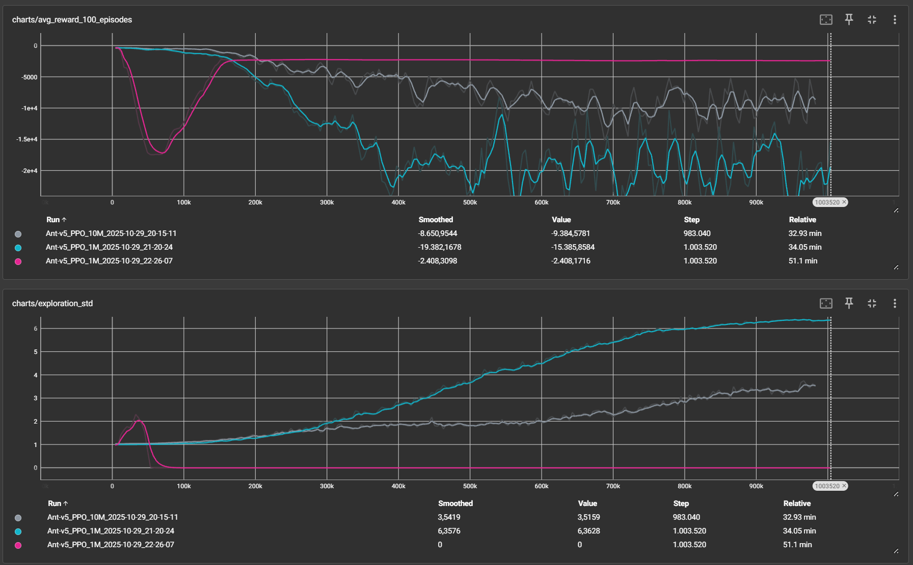

# Training a MuJoCo Ant Agent from Scratch with PPO

This project is a from-scratch implementation of the **Proximal Policy Optimization (PPO)** algorithm using PyTorch for the `Ant-v5` environment from the `gymnasium[mujoco]` library. The primary goal of this project is to train a four-legged ant agent to walk forward without falling over.

This work serves as a foundational step for understanding the internal dynamics and practical challenges of modern Deep Reinforcement Learning algorithms before moving on to more complex robotics simulations, such as NVIDIA Isaac Sim.



## 🚀 Key Features

- **From-Scratch PPO Implementation:**
    - Actor-Critic architecture.
    - Generalized Advantage Estimation (GAE) for stable advantage calculation.
    - Clipped Surrogate Objective, the core component of PPO.
- **GPU Support:** Automatically utilizes a CUDA-enabled GPU if available, significantly accelerating the training process.
- **Experiment Tracking:** Integrated with **TensorBoard** to provide real-time visualization of critical metrics such as rewards, loss functions, and exploration rate.
- **Model Management:** The trained model weights (`.pth` files) are saved at the end of training and can be loaded later to resume training or test the agent's performance.
- **Agent Testing:** Includes a separate `test_agent.py` script for visually evaluating the performance of a trained agent.
- **Stabilization Techniques:**
    - **Observation Normalization:** Implements a `RunningMeanStd` class to normalize observations, stabilizing the learning process.
    - **Advantage Normalization:** Normalizes advantage values within each batch to ensure stable policy updates.
    - **Entropy Regularization:** An entropy term is added to the loss function to encourage exploration and prevent premature convergence.

## ⚙️ Setup

This project requires Python 3.10+ and an installed version of MuJoCo.

1.  **Clone the Repository:**
    ```bash
    git clone https://github.com/mturan33/mujoco-ant-ppo.git
    cd mujoco-ant-ppo
    ```

2.  **Create and Activate a Virtual Environment:**
    ```bash
    python -m venv venv
    # On Windows:
    venv\Scripts\activate
    # On macOS/Linux:
    source venv/bin/activate
    ```

3.  **Install Required Libraries:**
    - **For CPU-only:**
        ```bash
        pip install -r requirements.txt
        ```
    - **For GPU (CUDA):** First, install the CUDA-enabled version of PyTorch, then install the remaining packages. (The command below is for CUDA 12.1; please check the [official PyTorch website](https://pytorch.org/get-started/locally/) for the correct command for your system.)
        ```bash
        pip3 install torch torchvision torchaudio --index-url https://download.pytorch.org/whl/cu121
        pip install gymnasium[mujoco] numpy tensorboard
        ```

## 🎮 Usage

### Starting the Training

To train the agent from scratch, run the following command:
```bash
python main.py
```
- Training logs will be printed to the console and saved to a unique `.txt` file in the `runs` directory.
- Model weights will be saved to the `models` directory upon completion of the training.

### Monitoring with TensorBoard

While the training is running, open a **new terminal**, navigate to the project's root directory, and run:
```bash
tensorboard --logdir=runs
```
Then, open your web browser and navigate to `http://localhost:6006/` to view the learning curves in real-time.

### Resuming from a Saved Model

To continue training from a saved model, set the `load_model` variable to `True` inside `main.py` and update the `base_experiment_name` to match the name of the model you wish to load.

### Testing a Trained Agent

To visually inspect the performance of a trained agent, run the `test_agent.py` script:
```bash
python test_agent.py
```
- Before running, make sure to update the `model_name` variable inside `test_agent.py` to match the name of the model you want to test (located in the `models` folder).

## 📝 Future Work

- [ ] Implement Soft Actor-Critic (SAC) from scratch and compare its performance with PPO.
- [ ] Design more complex environments with obstacles and uneven terrain.
- [ ] Incorporate camera data into the agent's observation space to explore Vision-based RL.
- [ ] Transfer the foundational knowledge gained from this project to a more advanced simulator like NVIDIA Isaac Sim.

## 👤 Author

**Mehmet Turan**
- GitHub: [@mturan33](https://github.com/mturan33)